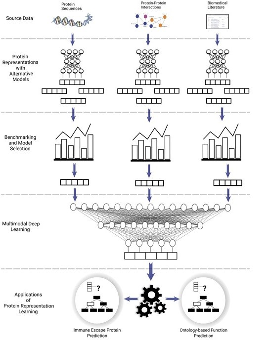

# Currently Under Improvment! We are diligently streamlining this repository for seamless automation!
# HOPER (Holistic Protein Representation)

<p align="center" width="100%">
    
</p>


-Holistic protein representation uses  multimodal learning model to predict protein functions even with low-data. 

-Representation vectors created using protein sequence, protein text and protein-protein interaction data types to achieve this goal.

-The rationale behind  incorporating protein-protein interactions into our holistic protein representation model is the assumption 
that interacting proteins are likely to act in the same biological process. Also, these proteins are probably located at the same location in the cell. 

-Text-based protein representations calculated with pre-trained natural language processing models.

-We aim to increase low-data prediction performance by using these three data types together.

# Installation Steps

## HOPER Instalation Instructions

* Clone HOPER repository

    git clone https://github.com/serbulent/HOPER.git
  
* Run python creat_env.py

* In order for the models to work, data, models files and uniprot_sprot.xml.gz files for uniprot preprocessing must be downloaded.Downloaded files are placed in the **HOPER** folder.

    -Data files instalation: https://drive.google.com/drive/folders/1tZ6Q60tQVaabEqUoBIu3CBiDa92Od3Nn?usp=sharing
  
    -Uniprot preprocessing data instalation: https://drive.google.com/file/d/1fOu7cWX9f-B-Ro41VvLGgG8eyGhV8IwD/view?usp=drive_link

## PPI Model Instalation Instructions
* To install packages to use for Node2vec and HOPE in your ppi_representations directory, use:

  * GEM version 213189b; use for old version:
  
    git clone [https://github.com/palash1992/GEM.git]
    
    git checkout  [213189b]

* To make Node2vec executable; Clone repository git clone https://github.com/snap-stanford/snap and Compiles SNAP. The code for compiles is as below:
  
  - cd snap/
  - rm -rf examples/Release
  - make all
  - cd examples/node2vec
  - chmod +x node2vec
  - ls -alh node2vec

* Make node2vec executable and add to system PATH or move it to the location you run.

* You can make protein names using edgelist_code.py These names will be needed later for the node2vec.py and HOPE.py files. Do not forget the location information.


## Text Model Installation Instructions

* To use text representation generator, copy uniprot and pubmed text files to HOPER/text_representations/representation_generation/data/ in separate folders named as uniprot and pubmed.
  
* biosentvec and biowordvec models must be downloaded to HOPER/text_representations/representation_generation/models from the urls given below. Alternatively model_download parameter must be set as "y" to download models automatically if biosentvec or biowordvec representations selected to be generated.

https://ftp.ncbi.nlm.nih.gov/pub/lu/Suppl/BioSentVec/BioSentVec_PubMed_MIMICIII-bigram_d700.bin
https://ftp.ncbi.nlm.nih.gov/pub/lu/Suppl/BioSentVec/BioWordVec_PubMed_MIMICIII_d200.bin

  
# How to run HOPER

Run module main function after editing  the configuration file Hoper.yaml as below examples as;

```
python Hoper_representation_generetor_main.py 
```

* Run HOPER to produce Text Representation Preprocessing [readme.md](https://github.com/serbulent/HOPER/tree/main/text_representations/preprocess)
  
```
  choice_of_module: [Preprocessing] # Module selection PPI,Preprocessing,SimpleAe
 #********************Preprocessing Module********************************
    module_name: Preprocessing
    uniprot_dir: ./uniprot_sprot.xml.gz 
```
* Run HOPER to produce text representation example for more information please read
[readme.md](https://github.com/serbulent/HOPER/blob/main/text_representations/representation_generation/README.md)

```
 parameters:
     module_name: text
    choice_of_process:  [generate,visualize]
    generate_module:
        choice_of_representation_type:  [all]
        uniprot_files_path:  [./text_representations/representation_generation/data/uniprot/]
        pubmed_files_path:  [./text_representations/representation_generation/data/pubmed/]
        model_download: y
    visualize_module:
        choice_of_visualization_type:  [a]
        result_files_path:  [./data/text_representations/result_visualization/result_files/results/]
```

* Run HOPER to produce PPI representation example for more information please read
[readme.md](https://github.com/serbulent/HOPER/blob/main/ppi_representations/readme.md)

```

parameters:
    choice_of_module: [PPI] # Module selection PPI,Preprocessing,case_study
    #*************************************MODULES********************************************************************
    #********************PPI Module********************************
    module_name: PPI
    choice_of_representation_name:  [Node2vec,HOPE]
    interaction_data_path:  [./data/hoper_PPI/PPI_example_data/example.edgelist]
    protein_id_list:  [./data/hoper_PPI/PPI_example_data/proteins_id.csv]
    node2vec_module:
        parameter_selection:
            d:  [10]  
            p: [0.25]
            q:  [0.25]
    HOPE_module:
        parameter_selection:
            d:  [5]
            beta:  [0.00390625]
```

* Run HOPER to produce SimpleAE example
  
```

parameters:
    choice_of_module: [SimpleAe] # Module selection PPI,Preprocessing,SimpleAe
#*******************SimpleAe*********************************************
    module_name: SimpleAe #Protein sequence based protein representation 
    representation_path: ./case_study/case_study_results/modal_rep_ae_node2vec_binary_fused_representations_dataframe_multi_col.csv

```

  
* Run HOPER to produce MultiModalAE example

* Run HOPER to produce TransferAE example

*Reproducible run of paper

```
python case_study_main.py
```
* Run case_study_main.py for making immun escape prediction for more information please read
[readme.md](https://github.com/serbulent/HOPER/blob/main/case_study/readme.md)

```
parameters:
    choice_of_module: [case_study] 
    #********************case_study Module********************************
    module_name: case_study
    choice_of_task_name:  [fuse_representations] #prepare_datasets,fuse_representations,model_training_test,prediction
    fuse_representations:
        representation_files: [./data/representation_files/node2vec_d_50_p_0.5_q_0.25_multi_col.csv,./data/hoper_case_study_example_data/representation_files/multi_modal_rep_ae_multi_col_256.csv]
        min_fold_number:  2
        representation_names:  [modal_rep_ae,node2vec]        
    prepare_datasets:  
        positive_sample_data:  ["./data/hoper_case_study_example_data/prepare_datasets/positive.csv"]
        negative_sample_data:  ["./data/hoper_case_study_example_data/prepare_datasets/neg_data.csv"]
        prepared_representation_file:  [./data/hoper_case_study_example_data/representation_files/node2vec_d_50_p_0.5_q_0.25_multi_col.csv] 
        representation_names:  [modal_rep_ae] 
    
    model_training_test:
        representation_names:  [modal_rep_ae]
        scoring_function:  ["f_max"]  #"f1_micro",f1_macro","f1_weighted"
        prepared_path:  ["./case_study/case_study_results/modal_rep_ae_node2vec_binary_data.pickle"]
        classifier_name:  ["Fully_Connected_Neural_Network"] 
   
    prediction:
        representation_names:  [modal_rep_ae]
        prepared_path:  ["./data/hoper_case_study_example_data/prediction_example_data/rep_dif_ae.csv"]
        classifier_name:  ['Fully_Connected_Neural_Network']         
        model_directory:  ["./case_study/case_study_results/training/m_o_d_a_l___r_e_p___a_e___n_o_d_e_2_v_e_c_Fully_Connected_Neural_Network_binary_classifier.pt"] 
```
